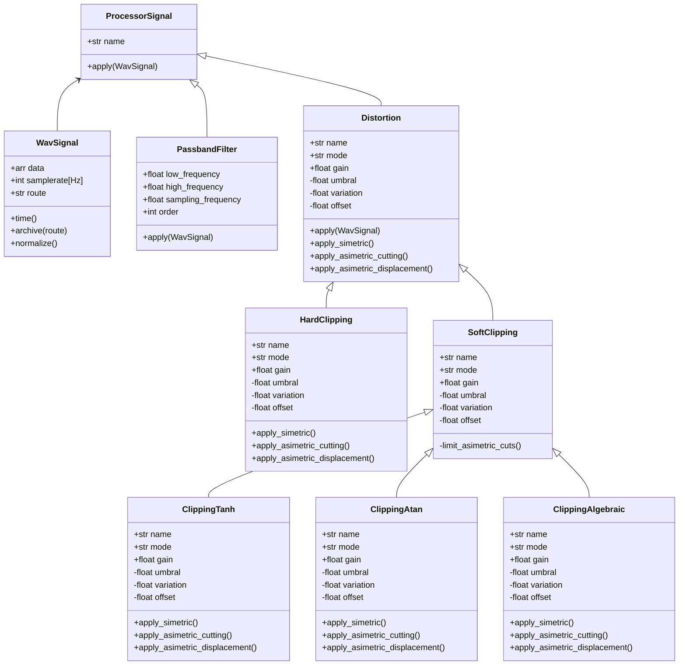

# Blue_Slashes 
### Modelado, simulación y análisis de efectos de audio para música experimental
Este repositorio contiene el proyecto para la materia de Programación Orientada a Objetos (POO), semestre 2025-2.

Basado en el paradigma de la POO, se modelan distintos efectos/procesadores digitales aplicados a señales de audio en formato '.wav'. Entre ellos por el momento se incluyen la distorsión (Hard y Soft Clipping), el delay y el filtrado pasabanda.

Los efectos con un comportamiento espectral, como la distorsion o el filtrado, se analizan mediante la transformada rápida de Fourier y en espectrogramas, mientras que otros como el delay, se buscaria visualizarlos principalmente en el dominio del tiempo.

Una interfaz gráfica interactiva permite observar como cada procesamiento influye en la forma de la onda y en su distribucion frecuencial, lo cual ofrece una herramienta de análisis y control en la experimentación sonora.

## Representacion y procesamiento de la señal .wav
Para el modelado de la señal, se implementa la clase WavSignal, que se encarga de representar una señal en formato .wav y de realizar sobre ella operaciones que son fundamentales en el dominio del tiempo y de la frecuencia.

En esta clase se encapsulan las siguientes funciones:

- Lectura del archivo:
  Utiliza la librería soundfile para extraer los datos de amplitud (data) y la frecuencia de muestreo (samplerate).

  En caso de que el archivo sea estéreo, se toma un solo canal y se convierte a mono para simplificar el procesamiento y analisis de la señal.

- Normalización:
  La señal se ajusta en un rango de [-1,1], multiplicando a cada muestra el inverso multiplicativo del valor máximo del vector.

  Esto garantiza que todas las operaciones posteriores se realicen sobre una escala de amplitud fija y uniforme.

- Eje temporal:
  A partir del número de muestras y la frecuencia de muestreo, se genera un vector de tiempo que permite graficar la señal en el dominio del tiempo.

- Transformada Rápida de Fourier (FFT):
  Permite analizar el contenido de frecuencias que tiene la señal.
  La FFT convierte la información del dominio del tiempo al dominio de la frecuencia, generando dos vectores:

  - frequencies: frecuencias en Hz.

  - magnitude: magnitud normalizada o expresada en decibelios (dB).

  Esto permite visualizar qué frecuencias/armónicos dominan en la señal y cómo varían tras aplicar un efecto y determinar un correcto filtrado.

- Espectrograma:
  Calcula la energía de la señal en el tiempo y la frecuencia simultáneamente.
  Se obtiene mediante el método spectrogram, extraído del modulo spicy, que devuelve las matrices de frecuencia (f), tiempo (t) y densidad espectral (Sxx).

  En este caso, el espectrograma se representa en decibelios (dB) para apreciar los niveles de energía más y menos intensos. 

  Para representar la intensidad de las frecuencias en una escala logarítmica se utiliza la conversión a decibelios:

$$
S_{dB}(f, t) = 10 \log_{10} (|S(f, t)|^2 + \epsilon)
$$

donde \( |S| \) es la magnitud del espectro de la señal.

## Distorsión 
La distorsion es un proceso donde, en una señal con amplitud normalizada se busca limitar sus umbrales en un punto fijo, y por medio de una multiplicación (ganancia), esta no tenga mas opción que aplastarse en sus límites.

### Hard-Clipping
El Hard-Clipping es un tipo de distorsión que recorta los umbrales de la señal en un valor dado. Al aplicar una ganancia a la señal hard-clippeada y con límites, esta se aplasta entre ellos y produce una distorsión de la señal áspera y agresiva.

$$ 
y =
\begin{cases}
A, & x > A \\
x, & -A \leq x \leq A \\
-A, & x < -A
\end{cases}
$$

donde:
- \( x \): señal de entrada normalizada.  
- \( y \): señal de salida procesada.  
- \( A \): umbral máximo de amplitud permitido.

### Soft-Clipping
El Soft-Clipping es un tipo de distorsión que procesa la señal por funciones de transferencia continuas, que necesariamente tienen una región lineal en valores cercanos a cero y asintotas horizontales que no permiten que la señal misma sobrepase ese valor al aplicarse una ganancia sobre ella.

En el proyecto, se utilizan 3 funciones de transferencia, en las cuales se procesa el vector 'data' que contiene los valores de magnitud de la señal.

#### 1. Tangente hiperbólica (tanh)
Produce una distorsión suave y musical. Limita la señal entre -1 y 1.

$$
y = \tanh(kx)
$$

#### 2. Arcotangente (arctan)
Similar a la anterior, pero con una respuesta más progresiva y menos abrupta en la saturación.

$$
y = \frac{2}{\pi} \arctan(kx)
$$

#### 3. Algebraic
Una alternativa que simula una función con las propiedades de funciones de transferencia.

$$
y = \frac{x}{1 + |kx|}
$$

En todas estas funciones:
- \( x \): señal de entrada normalizada.  
- \( y \): señal de salida procesada. 
- \( k \): controla la ganancia o intensidad de la distorsión.  
  Valores altos producen una saturación más pronunciada.

Estas funciones tienen como principales características esenciales del Soft-Clipping, una respuesta suave y continua, generando una distorsión cálida y amplia armónicamente.

### Escalabilidad y variaciones asimétricas 
El código se diseño para que además de modelar simplemente un efecto sonoro, permitiera tener un control experimental sobre este de la más alta escalabilidad, diferenciándolo de pedaleras con un solo tipo de distorsión y parámetros limitados.

Este sistema de distorsión también permite modificar el carácter del efecto mediante la aplicación de asimetrías al Hard-clipping y a las funciones de transferencia. Romper esta simetría en la señal generas componentes armónicos pares y como resultado un sónido mas suave y orgánico.

#### Tipos de Asimetrías implementadas
- Simétrico:
  Aplica la misma ganancia en ambos lados de la señal. Suena mas agresivo, pero artificial.
  
  
  $y = \tanh(x \cdot g)$

- Recorte asimétrico:
  Recorta la señal de manera desigual: el límite positivo y el límite negativo son distintos. Sonido orgánico y cálido.
  
  $y = \tanh(\text{clip}(x \cdot g, L_{neg}, L_{pos}))$

- Asimetría por desplazamiento:
  Desplaza toda la señal hacia arriba o abajo antes de aplicar la función no lineal. Suave, valvular y mas natural.
   
  $y = \tanh((x + o) \cdot g)$

## Filtrado Pasabanda
El filtrado Pasabanda se diseña para dejar pasar solo un rango especifico de frecuencias que viven en la señal, atenuando las que se encuentran por encima o debajo de los limites definidos.

Los parametros son:
- low_frequency (Hz): frecuencia de corte inferior.
- high_frequency (Hz): frecuencia de corte superior.
- sampling_frequency (Hz): frecuencia de muestreo de la señal.
- order: orden del filtro, que determina la pendiente de atenuación fuera de la banda pasante (en dB/octava).

### Implementación
Se utiliza el módulo scipy.signal, específicamente las funciones butter() y lfilter().
- butter() calcula los coeficientes del filtro Butterworth, un tipo de filtro que garantiza una respuesta suave y sin ondulaciones en la banda pasante.
- lfilter() aplica dichos coeficientes al vector de la señal, generando una versión filtrada.

### Fórmulas y fundamentos del filtro
El filtro pasabanda de Butterworth está definido por la siguiente función de transferencia:

$$
H(s) = \frac{1}{1 + \left( \frac{B s}{s^2 + \omega_0^2} \right)^{2n}}
$$

Donde:

- La frecuencia central es

$$
\omega_0 = \sqrt{\omega_L \cdot \omega_H}
$$

- El ancho de banda es

$$
B = \omega_H - \omega_L
$$

- n es el orden del filtro	​
- ωL, ωH​ son las frecuencias de corte inferior y superior.

Las frecuencias de corte se normalizan respecto a la frecuencia de Nyquist, definida como la mitad de la frecuencia de muestreo:

$$
f_{norm} = \frac{f_{cutoff}}{f_s / 2}
$$

Esto garantiza que los valores estén en el rango [0,1] requerido por los algoritmos de diseño digital.

Así el comportamiento en la salida las frecuencias dentro de la banda mantienen una amplitud casi constante y las frecuencias fuera de la banda se atenúan progresivamente según el orden del filtro.
Entre mas se incremente el orden, mayor sera la pendiente de atenuación.

## Gestión de gráficas
La visualizacion de señales y efectos se realiza mediante una interfaz graficadora que corresponde a la libreria matplotlib, que nos ayuda a integrar tanto la representación de la señal en el dominio del tiempo, como su representación espectral (FFT y espectograma).

- Clase Control: Esta clase administra la ventana principal de control y la interfaz interactiva.
  - Genera botones que permiten al usuario seleccionar entre la señal original o la procesada por los efectos para visualizar sus respectivas graficas.
  - Se encarga de invocar los metodos de Graphs segun la accion del usuario, permitiendo una visualización dinamica con la visualización

- Clase Graphs: Es la clase responsable del trazado de las graficas.
  - Grafica la señal en el dominio del tiempo, su transformada de fourier (FFT) y el espectrograma.
  - Permite comparar la señal sin filtrado, con la ya filtrada de manera interactiva para tener conciencia de los cambios en el espectro al aplicar el filtro.
  - Cada grafica y tipo de visualización se presentan en subplots separados, utilizando colormaps adecuados para una visualización cómoda del espectrograma y escalas lineales para FFT y amplitud temporal.

Esta estructura sigue el principio de responsabilidad única, ya que separa la gestión de la interfaz (Control), de la generación de las graficas (Graphs). Además, siendo integrada con matplotlib, es posible moverse en un entorno flexible para la experimentación sonora y el análisis de efectos.

## Diagrama de Clases
El siguiente diagrama, representa la estructuración del paquete de código hasta el momento:

