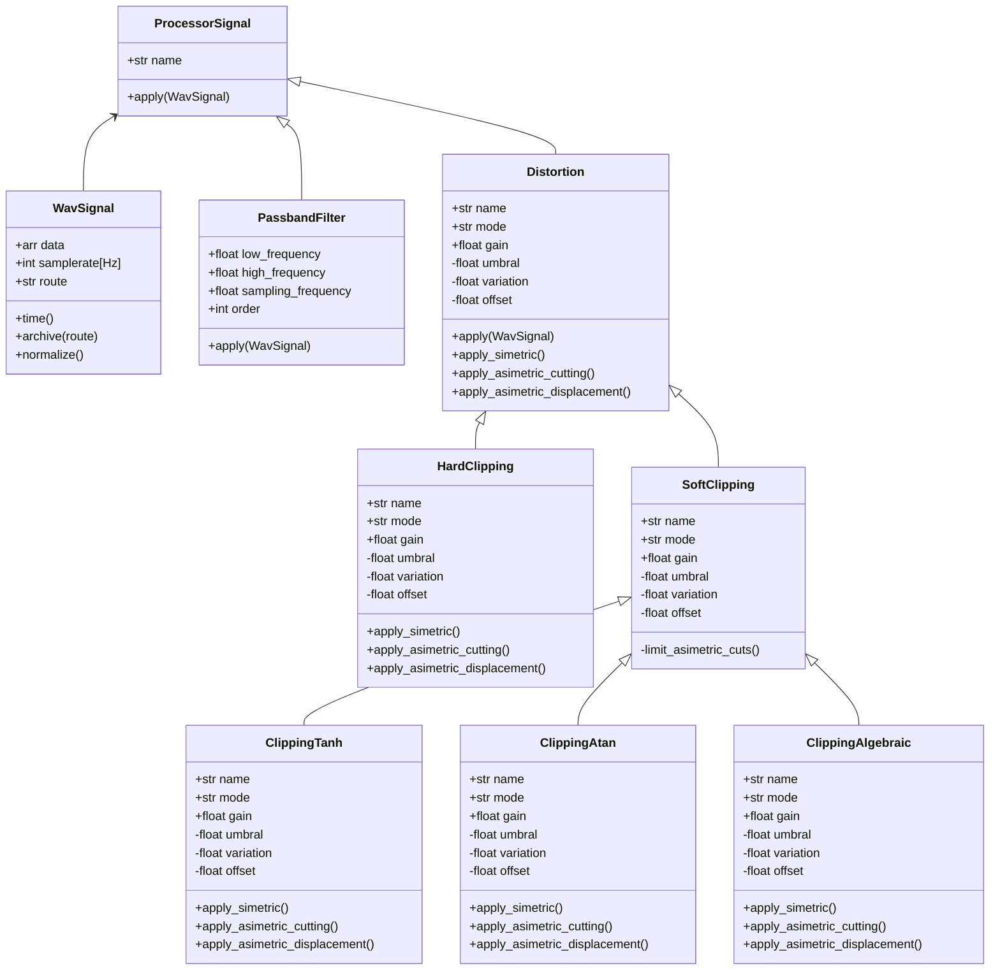

# Blue_Slashes - Modelado, simulación y análisis de efectos de audio para música experimental
Este repositorio contiene el proyecto para la materia de Programación Orientada a Objetos (POO), semestre 2025-2.

Basado en el paradigma de la POO, se modelan distintos efectos/procesadores digitales aplicados a señales de audio en formato '.wav'. Entre ellos por el momento se incluyen la distorsión (Hard y Soft Clipping), el delay y el filtrado pasabanda.

Los efectos con un comportamiento espectral, como la distorsion o el filtrado, se analizan mediante la transformada rápida de Fourier y en espectrogramas, mientras que otros como el delay, se buscaria visualizarlos principalmente en el dominio del tiempo.

Una interfaz gráfica interactiva permite observar como cada procesamiento influye en la forma de la onda y en su distribucion frecuencial, lo cual ofrece una herramienta de análisis y control en la experimentación sonora.

## Representacion y procesamiento de la señal .wav
Para el modelado de la señal, se implementa la clase WavSignal, que se encarga de representar una señal en formato .wav y de realizar sobre ella operaciones que son fundamentales en el dominio del tiempo y de la frecuencia.

En esta clase se encapsulan las siguientes funciones:

- Lectura del archivo:
Utiliza la librería soundfile para extraer los datos de amplitud (data) y la frecuencia de muestreo (samplerate).

En caso de que el archivo sea estéreo, se toma un solo canal y se convierte a mono para simplificar el procesamiento y analisis de la señal.

- Normalización:
La señal se ajusta en un rango de [-1,1], multiplicando a cada muestra el inverso multiplicativo del valor máximo del vector.

Esto garantiza que todas las operaciones posteriores se realicen sobre una escala de amplitud fija y uniforme.

-Eje temporal:
A partir del número de muestras y la frecuencia de muestreo, se genera un vector de tiempo que permite graficar la señal en el dominio del tiempo.

-Transformada Rápida de Fourier (FFT):
Permite analizar el contenido de frecuencias que tiene la señal.
La FFT convierte la información del dominio del tiempo al dominio de la frecuencia, generando dos vectores:

  -frequencies: frecuencias en Hz.
  -magnitude: magnitud normalizada o expresada en decibelios (dB).

Esto permite visualizar qué frecuencias/armónicos dominan en la señal y cómo varían tras aplicar un efecto y determinar un correcto filtrado.

-Espectrograma:
Calcula la energía de la señal en el tiempo y la frecuencia simultáneamente.
Se obtiene mediante el método spectrogram, extraído del modulo spicy, que devuelve las matrices de frecuencia (f), tiempo (t) y densidad espectral (Sxx).

En este caso, el espectrograma se representa en decibelios (dB) para apreciar los niveles de energía más y menos intensos. 

Para representar la intensidad de las frecuencias en una escala logarítmica se utiliza la conversión a decibelios:

$$
S_{dB} = 10 \log_{10} (|S|^2)
$$

donde \( |S| \) es la magnitud del espectro de la señal.


## Distorsión 
La distorsion es un proceso donde, en una señal con amplitud normalizada se busca limitar sus umbrales en un punto fijo, y por medio de una multiplicación (ganancia), esta no tenga mas opción que aplastarse en sus límites.

### Hard-Clipping
El Hard-Clipping es un tipo de distorsión que recorta los umbrales de la señal en un valor dado. Al aplicar una ganancia a la señal hard-clippeada y con límites, esta se aplasta entre ellos y produce una distorsión de la señal áspera y agresiva.

 ```math
y =
\begin{cases}
A, & x > A \\
x, & -A \leq x \leq A \\
-A, & x < -A
\end{cases}

### Soft-Clipping
El Soft-Clipping es un tipo de distorsión que procesa la señal por funciones de transferencia continuas, que necesariamente tienen una región lineal en valores cercanos a cero y asintotas horizontales que no permiten que la señal misma sobrepase ese valor al aplicarse una ganancia sobre ella.

En el proyecto, se utilizan 3 funciones de transferencia, en las cuales se procesa el vector 'data' que contiene los valores de magnitud de la señal.

### 1. Tanh - Tangente hipérbolica
La tangente hipérbolica es una función no lineal que cumple con las propiedades de funciones de transferencia para Soft-Clipping, con asintotas horizontales en 1 y -1.

$y = \tanh(x)$.

## Diagrama de Clases
El siguiente diagrama, representa la estructuración del paquete de código hasta el momento:

