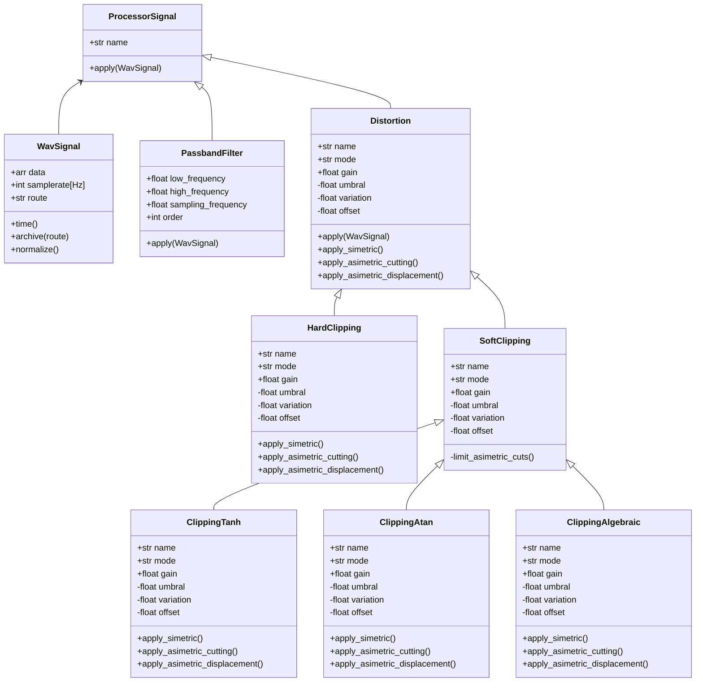

# Blue_Slashes - Efectos de Pedal
Este repositorio contiene el proyecto para la materia de Programación Orientada a Objetos (POO), semestre 2025-2. En este caso se busca crear un código con base en el paradigma de la POO, para simular los efectos de una pedalera de guitarra. Algunos de los efectos buscados a trabajar son, la distorsión, el delay, el chorus, y un ecualizador (?).

## Diagrama de Clases
El siguiente diagrama, representa la estructuración del paquete de código hasta el momento:

