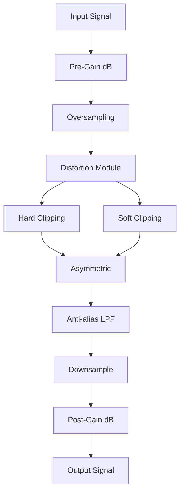
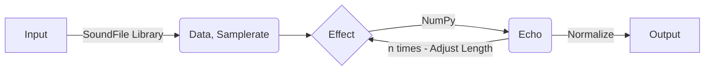
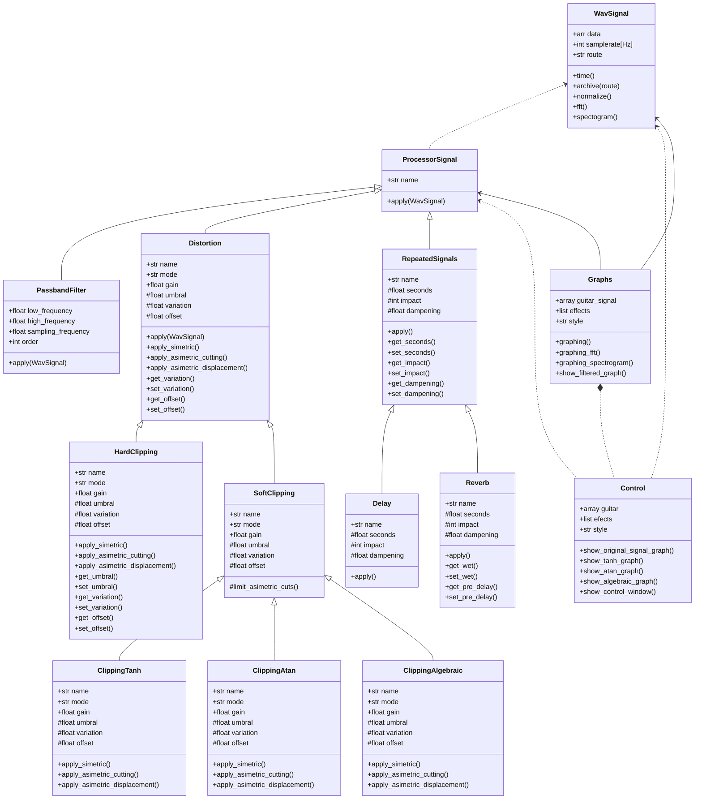

# Blue_Slashes 
### Modelado, simulación y análisis de efectos de audio para música experimental
Este repositorio contiene el proyecto para la materia de Programación Orientada a Objetos (POO), semestre 2025-2.

Basado en el paradigma de la POO, se modelan distintos efectos/procesadores digitales aplicados a señales de audio en formato '.wav'. Entre ellos por el momento se incluyen la distorsión (Hard y Soft Clipping), el delay y el filtrado pasabanda.

Los efectos con un comportamiento espectral, como la distorsion o el filtrado, se analizan mediante la transformada rápida de Fourier y en espectrogramas, mientras que otros como el delay, se buscaria visualizarlos principalmente en el dominio del tiempo.

Una interfaz gráfica interactiva permite observar como cada procesamiento influye en la forma de la onda y en su distribucion frecuencial, lo cual ofrece una herramienta de análisis y control en la experimentación sonora.

## Representacion y procesamiento de la señal .wav
La clase WavSignal modela una señal de audio en formato .wav, permitiendo su análisis en los dominios del tiempo y la frecuencia mediante operaciones fundamentales.

Librerías utilizadas: soundfile para lectura/escritura de audio, numpy para operaciones numéricas, scipy.signal para análisis espectral, matplotlib para visualización.

- Lectura del archivo: utiliza soundfile para obtener los datos de amplitud y la frecuencia de muestreo en tipo de dato array y float respectivamente. Si el archivo es estéreo, se convierte a mono para simplificar el análisis.

- Normalización: ajusta la amplitud al rango [−1,1], garantizando una escala uniforme para el procesamiento. Implementada con numpy para operaciones vectoriales eficientes.

- Eje temporal: genera un vector de tiempo a partir del número de muestras y la frecuencia de muestreo, facilitando la representación temporal usando numpy.arange.

- Transformada Rápida de Fourier (FFT): implementada con numpy.fft, transforma la señal del dominio temporal al de la frecuencia, generando los vectores de frecuencias y magnitudes (normalizadas o en decibelios).

- Espectrograma: calculado con scipy.signal.spectrogram, muestra la distribución de energía en el tiempo y la frecuencia. Se representa en decibelios (dB) mediante:
  
$$
S_{dB}(f, t) = 20 \log_{10} (|S(f, t)| + \epsilon)
$$

donde \( |S| \) es la magnitud del espectro de la señal.

## Distorsión 
La distorsion es un proceso donde, en una señal con amplitud normalizada se busca limitar sus umbrales en un punto fijo, y por medio de una multiplicación (ganancia), esta no tenga mas opción que aplastarse en sus límites.

Librerías: numpy para operaciones matemáticas vectorizadas en todas las funciones de distorsión.

Este efecto sigue un flujo estricto para considerarse una distorsión profesional, cada proceso esta dividido por módulos que procesan la señal deacuerdo a su función:

### Pre-Gain
Antes de procesar la señal normalizada por el Clipping, se multiplica ese vector de muestreo, por un factor, que dado un valor lineal, se convierte a uno en escala logaritmica (dB):

$$
A = 10^{\frac{\text{gain}_{\text{dB}}}{20}}
$$

Donde:

$A$ = factor de amplitud lineal

$dB$ = ganancia en decibelios

### Oversampling - Antialias - Downsampling
En este proceso se aumenta artificialmente la frecuencia de muestreo de la señal digital por un factor L (upsampling). Este factor inserta L-1 ceros entre cada muestra original.
Suponiendo un vector de muestras original:

$$
\mathbf{x} = [\, x_0,\; x_1,\; x_2,\; x_3 \,]
$$

Vector con upsampling:

$$
\mathbf{x}_{\uparrow 4}
= [\, x_0,\; 0,\; 0,\; 0,\; x_1,\; 0,\; 0,\; 0,\; x_2,\; 0,\; 0,\; 0,\; x_3 \,]
$$

Luego de insertar los ceros, se generan imágenenes espectrales en los múltiplos de la frecuencia original de muestreo, para eliminarlas, se aplica un filtro pasa-bajos con cutoff = Nyquist.

Librerias: scipy.signal y sus funciones firwin() y lfilter.
firwin() genera un vector de coeficientes h[k], del muestreo con upsampling, con tamaño M y cutoff = 1/L.
lfilter() aplica una convolucion en el dominio del tiempo al vector con upsampling usando los coeficientes de h[k]:

$$
y[n] = \sum_{k=0}^{M-1} h[k]\, x[n-k]
$$

Los coeficientes h[k] se diseñan para que:

$$
H(\omega) \approx 1 \quad \text{para } |\omega| < \omega_c
$$

$$
H(\omega) \approx 0 \quad \text{para } |\omega| > \omega_c
$$

H(ω) es la respuesta en frecuencia del filtro, donde el cutoff normalizado se fija como:

$$
\omega_c = \frac{1}{L}
$$

Luego del proceso anterior, la señal que resulta pasa por un clipping, generando nuevas frecuencias múltiplos de las existentes, por ello, se aplica nuevamente el filtro anterior FIR a ese vector clipeado.
En ese momento, se aplica downsampling, que consiste en devolver el sample rate a su tamaño original, descartando muestras dependiendo el L inicial:
Vector clippeado:

$$
\mathbf{x} = [\, x_0,\; x_1,\; x_2,\; x_3,\; x_4,\; x_5,\; x_6,\; x_7 \,]
$$

Vector downsampled con L=4:

$$
\mathbf{x}_{\downarrow 4}
= [\, x_0,\; x_4 \,]
$$

### Hard-Clipping
El Hard-Clipping es un tipo de distorsión que recorta los umbrales de la señal en un valor dado.  
La señal con una ganancia anterior y con límites, se aplasta entre ellos y produce una distorsión de la señal áspera y agresiva.

$$ 
y =
\begin{cases}
A, & x > A \\
x, & -A \leq x \leq A \\
-A, & x < -A
\end{cases}
$$

donde:
- \( x \): señal de entrada normalizada.  
- \( y \): señal de salida procesada.  
- \( A \): umbral máximo de amplitud permitido.

### Soft-Clipping
El Soft-Clipping es un tipo de distorsión que procesa la señal por funciones de transferencia continuas, que necesariamente tienen una región lineal en valores cercanos a cero y asintotas horizontales que no permiten que la señal misma sobrepase ese valor al aplicarse una ganancia sobre ella.

En el proyecto, se utilizan 3 funciones de transferencia, en las cuales se procesa el vector 'data' que contiene los valores de magnitud de la señal.

#### 1. Tangente hiperbólica (tanh)
Produce una distorsión suave y musical. Limita la señal entre -1 y 1.

$$
y = \tanh(x)
$$

#### 2. Arcotangente (arctan)
Similar a la anterior, pero con una respuesta más progresiva y menos abrupta en la saturación.

$$
y = \frac{2}{\pi} \arctan(x)
$$

#### 3. Algebraic
Una alternativa que simula una función con las propiedades de funciones de transferencia.

$$
y = \frac{x}{1 + |x|}
$$

En todas estas funciones:
- \( x \): señal de entrada normalizada.  
- \( y \): señal de salida procesada.  
 
Estas funciones tienen como principales características esenciales del Soft-Clipping, una respuesta suave y continua, generando una distorsión cálida y amplia armónicamente.

### Variaciones asimétricas 
Este sistema de distorsión también permite modificar el carácter del efecto mediante la aplicación de asimetrías al Hard-clipping y a las funciones de transferencia. Romper esta simetría en la señal generas componentes armónicos pares y como resultado un sónido mas suave y orgánico.

#### Tipos de Asimetrías implementadas
- Simétrico:
  Aplica la misma ganancia en ambos lados de la señal. Suena mas agresivo, pero artificial.
  
  
  $y = \tanh(x)$

- Recorte asimétrico:
  Recorta la señal de manera desigual: el límite positivo y el límite negativo son distintos. Sonido orgánico y cálido.
  
  $y = \tanh(\text{clip}(x, L_{neg}, L_{pos}))$

- Asimetría por desplazamiento:
  Desplaza toda la señal hacia arriba o abajo antes de aplicar la función no lineal. Suave, valvular y mas natural.
   
  $y = \tanh((x + o))$

## Filtrado Pasabanda
El filtrado Pasabanda se diseña para dejar pasar solo un rango especifico de frecuencias que viven en la señal, atenuando las que se encuentran por encima o debajo de los limites definidos.

Librerías: scipy.signal para diseño e implementación de filtros digitales.

Los parametros son:
- low_frequency (Hz): frecuencia de corte inferior.
- high_frequency (Hz): frecuencia de corte superior.
- sampling_frequency (Hz): frecuencia de muestreo de la señal.
- order: orden del filtro, que determina la pendiente de atenuación fuera de la banda pasante (en dB/octava).

### Implementación
Se utiliza el módulo scipy.signal, específicamente las funciones butter() y lfilter().
- butter() calcula los coeficientes del filtro Butterworth, un tipo de filtro que garantiza una respuesta suave y sin ondulaciones en la banda pasante.
- lfilter() aplica dichos coeficientes al vector de la señal, generando una versión filtrada.

### Fórmulas y fundamentos del filtro
El filtro pasabanda de Butterworth está definido por la siguiente función de transferencia:

$$
H(s) = \frac{1}{1 + \left( \frac{B s}{s^2 + \omega_0^2} \right)^{2n}}
$$

Donde:

- La frecuencia central es

$$
\omega_0 = \sqrt{\omega_L \cdot \omega_H}
$$

- El ancho de banda es

$$
B = \omega_H - \omega_L
$$

- n es el orden del filtro	​
- ωL, ωH​ son las frecuencias de corte inferior y superior.

Las frecuencias de corte se normalizan respecto a la frecuencia de Nyquist, definida como la mitad de la frecuencia de muestreo:

$$
f_{norm} = \frac{f_{cutoff}}{f_s / 2}
$$

Esto garantiza que los valores estén en el rango [0,1] requerido por los algoritmos de diseño digital.

Así el comportamiento en la salida las frecuencias dentro de la banda mantienen una amplitud casi constante y las frecuencias fuera de la banda se atenúan progresivamente según el orden del filtro.
Entre mas se incremente el orden, mayor sera la pendiente de atenuación.

## Efectos de Repetición
Los Efectos de Repetición sobre el tiempo, basan su funcionalidad en guardar la señal de audio y repetirla posteriormente con diferentes alteraciones a los datos de entrada.

### Implementación General
Ambos efectos tienen una implementación similar, que puede resumirse en el siguiente diagrama de flujo:

### Delay
El delay guarda la señal de audio en la memoria, y la emplea nuevamente según los datos de la pista de audio proveída y los atributos declarados por el usuario. 

Librerías: Se hace uso de la librería Soundfile para manejar la data y samplerate de las entradas de audio. Y de la librería Numpy para trabajar estos datos como arrays.

Así, sus parámetros son:
- seconds: segundos después de los cuales se repite la pista de audio
- repeats: cantidad de veces la cual el efecto es repetido
- dampening: porcentaje por el cual la señal repetida se debilita

Para aplicar los efectos de delay de manera que suenen coherentes, se tiene que seguir la siguiente tabla (valores con respecto a un BPM de 120), de manera que al repetir la señal, no suene fuera de lugar, sino que contribuya a la pista.

| Note Value |	Notes |	Dotted | Triplets |
| --- | --- | --- | --- |
| 1/1 (1 Bar) |	2000 ms / 0.5 Hz | 3000 ms / 0.33 Hz | 1333.33 ms / 0.75 Hz |
| 1/2 (2 Beats) | 1000 ms / 1 Hz | 1500 ms / 0.67 Hz |	666.67 ms / 1.5 Hz |
| 1/4 (1 Beat) | 500 ms / 2 Hz |750 ms / 1.33 Hz | 333.33 ms / 3 Hz |
| 1/8 |	250 ms / 4 Hz |	375 ms / 2.67 Hz |	166.67 ms / 6 Hz |
| 1/16 | 125 ms / 8 Hz | 187.5 ms / 5.33 Hz |	83.33 ms / 12 Hz |
| 1/32 | 62.5 ms / 16 Hz |	93.75 ms / 10.67 Hz |	41.67 ms / 24 Hz |
| 1/64 | 31.25 ms / 32 Hz |	46.88 ms / 21.33 Hz |	20.83 ms / 48 Hz |
| 1/128 | 15.63 ms / 64 Hz | 23.44 ms / 42.67 Hz |	10.42 ms / 96 Hz |
| 1/256 | 7.81 ms / 128 Hz | 11.72 ms / 85.33 Hz | 	5.21 ms / 192 Hz |
| 1/512	| 3.91 ms / 256 Hz | 5.86 ms / 170.67 Hz |	2.6 ms / 384 Hz |

Fuente: [Delay & Reverb Calculator](https://anotherproducer.com/online-tools-for-musicians/delay-reverb-time-calculator)

### Reverb
El reverb es un efecto basado en imitar un sonido de eco de manera natural, a diferencia del delay que es repetido dado unos atrtibutos constantes y definidos. Por su parte el reverb hace uso de aleatoriedad, para generar un sonido más cálido y humano al realizar sus ecos.

Librerías: Nuevamente se hace uso de Numpy, para trabajar con los arrays de data, y el uso de random.randn para generar aleatoriedad con respecto a la distribución normal, y crear valores con no mucha desviación.

También hacemos uso del Filtro Pasabanda implementado con anterioridad, esta vez como un Filtro PasaBajo, haciendo que las frecuencias altas no estén presentes en los ecos, haciendo que suenen como en un entorno real, con variación aleatoria implementada por Numpy.

Sus parámetros entonces, son:
- seconds: segundos después de los cuales se producen los ecos
- repeats: cantidad de repeticiones de los ecos
- dampening: porcentaje por el cual cada eco se debilita
- wet: porcentaje de mezcla entre la señal original, y la señal con ecos aplicados
- pre_delay: intervalo fijo antes que empiecen los ecos posteriores

## Gestión de gráficas - visualización de señales y efectos
La visualización se realiza mediante matplotlib, integrando las representaciones en el dominio del tiempo, la FFT y el espectrograma.

Librerías: matplotlib.pyplot para creación de figuras y subplots, matplotlib.widgets para elementos interactivos.

  - Clase Control: administra la ventana principal e interfaz interactiva.
  - Genera los botones que permiten alternar entre la señal original y las procesadas.
  - Invoca los métodos de Graphs según la acción del usuario, permitiendo una visualización dinámica.

  - Clase Graphs: gestiona el trazado de las gráficas.
  - Representa la señal en el tiempo, su espectro (FFT) y el espectrograma.
  - Permite comparar versiones filtradas y no filtradas mediante subplots separados y colormaps adecuados.

Esta organización respeta el principio de responsabilidad única, separando la interfaz del control de la generación de gráficos, y ofrece un entorno flexible para la experimentación sonora y el análisis de efectos.

## Diagrama de Clases
El siguiente diagrama, representa la estructuración del paquete de código hasta el momento:

