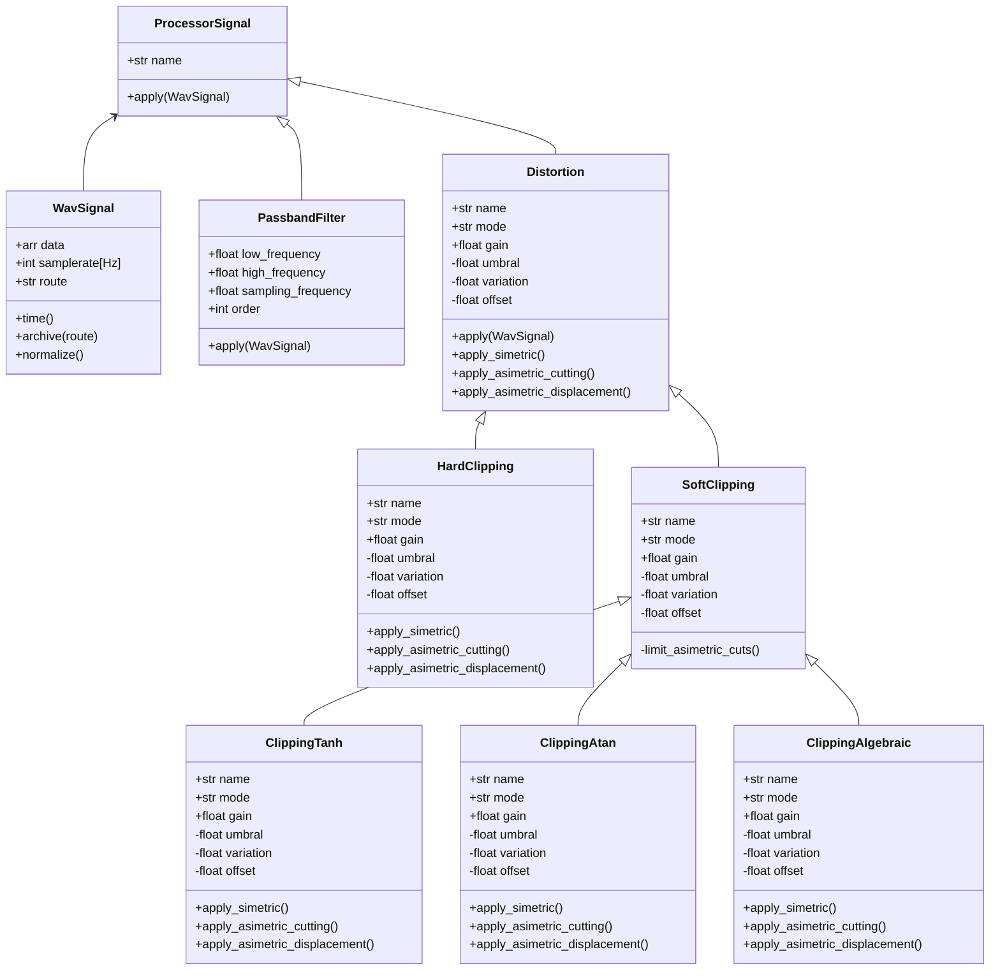

# Blue_Slashes - Modelado, simulación y análisis de efectos de audio para música experimental
Este repositorio contiene el proyecto para la materia de Programación Orientada a Objetos (POO), semestre 2025-2.

Basado en el paradigma de la PO0, se modelan distintos efectos/procesadores digitales aplicados a señales de audio en formato '.wav'. Entre ellos por el momento se incluyen la distorsión (Hard y Soft Clipping), el delay y el filtrado pasabanda.

Los efectos con un comportamiento espectral, como la distorsion o el filtrado, se analizan mediante la transformada rápida de Fourier y en espectrogramas, mientras que otros como el delay, se buscaria visualizarlos principalmente en el dominio del tiempo.

Una interfaz gráfica interactiva permite observar como cada procesamiento influye en la forma de la onda y en su distribucion frecuencial, lo cual ofrece una herramienta de análisis y control en la experimentación sonora.

## Distorsión 
La distorsion es un proceso donde, en una señal con amplitud normalizada se busca limitar sus umbrales en un punto fijo, y por medio de una multiplicación (ganancia), esta no tenga mas opción que aplastarse en sus límites.

### Hard-Clipping
El Hard-Clipping es un tipo de distorsión que recorta los umbrales de la señal en un valor dado. Al aplicar una ganancia a la señal hard-clippeada y con límites, esta se aplasta entre ellos y produce una distorsión de la señal áspera y agresiva.

### Soft-Clipping
El Soft-Clipping es un tipo de distorsión que procesa la señal por funciones de transferencia continuas, que necesariamente tienen una región lineal en valores cercanos a cero y asintotas horizontales que no permiten que la señal misma sobrepase ese valor al aplicarse una ganancia sobre ella. En el proyecto, se usan 3 funciones de transferencia, en las cuales se procesa el vector 'data' que contiene los valores de magnitud de la señal.

### 1. Tanh - Tangente hipérbolica
La tangente hipérbolica es una función no lineal que cumple con las propiedades de funciones de transferencia para Soft-Clipping, con asintotas horizontales entre 1 y -1. 
$y = \tanh(x)$.

## Diagrama de Clases
El siguiente diagrama, representa la estructuración del paquete de código hasta el momento:

```mermaid
classDiagram
    class WavSignal {
	    +arr data
	    +int samplerate[Hz]
	    +str route
	    +time()
	    +archive(route)
	    +normalize()
    }

    class ProcessorSignal {
	    +str name
	    +apply(WavSignal)
    }

    class PassbandFilter {
	    +float low_frequency
	    +float high_frequency
	    +float sampling_frequency
	    +int order
	    +apply(WavSignal)
    }

    class Distortion {
	    +str name
	    +str mode
	    +float gain
	    -float umbral
	    -float variation
	    -float offset
	    +apply(WavSignal)
	    +apply_simetric()
	    +apply_asimetric_cutting()
	    +apply_asimetric_displacement()
    }

    class HardClipping {
	    +str name
	    +str mode
	    +float gain
	    -float umbral
	    -float variation
	    -float offset
	    +apply_simetric()
	    +apply_asimetric_cutting()
	    +apply_asimetric_displacement()
    }

    class SoftClipping {
	    +str name
	    +str mode
	    +float gain
	    -float umbral
	    -float variation
	    -float offset
	    -limit_asimetric_cuts()
    }

    class ClippingTanh {
	    +str name
	    +str mode
	    +float gain
	    -float umbral
	    -float variation
	    -float offset
	    +apply_simetric()
	    +apply_asimetric_cutting()
	    +apply_asimetric_displacement()
    }

    class ClippingAtan {
	    +str name
	    +str mode
	    +float gain
	    -float umbral
	    -float variation
	    -float offset
	    +apply_simetric()
	    +apply_asimetric_cutting()
	    +apply_asimetric_displacement()
    }

    class ClippingAlgebraic {
	    +str name
	    +str mode
	    +float gain
	    -float umbral
	    -float variation
	    -float offset
	    +apply_simetric()
	    +apply_asimetric_cutting()
	    +apply_asimetric_displacement()
    }

    ProcessorSignal <-- WavSignal
    ProcessorSignal <|-- PassbandFilter
    ProcessorSignal <|-- Distortion
    Distortion <|-- HardClipping
    Distortion <|-- SoftClipping
    SoftClipping <|-- ClippingTanh
    SoftClipping <|-- ClippingAtan
    SoftClipping <|-- ClippingAlgebraic
```
